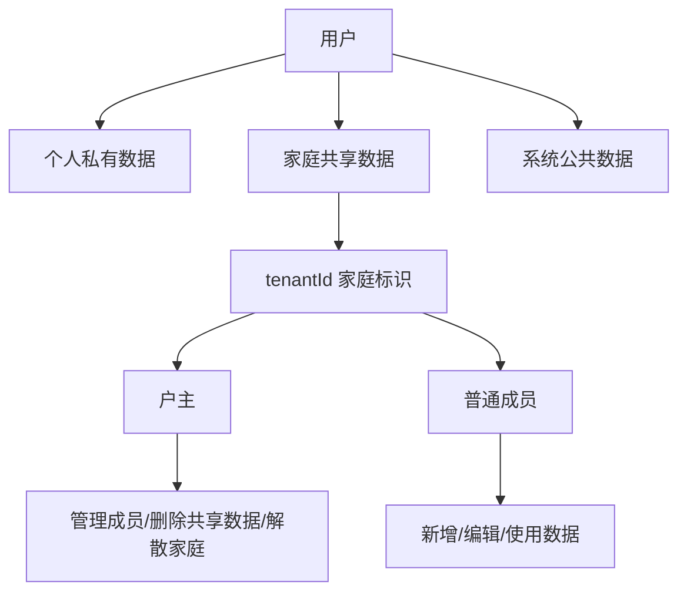
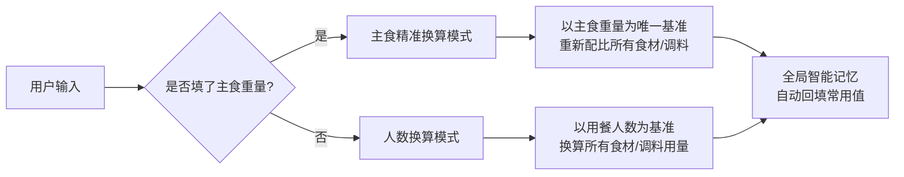
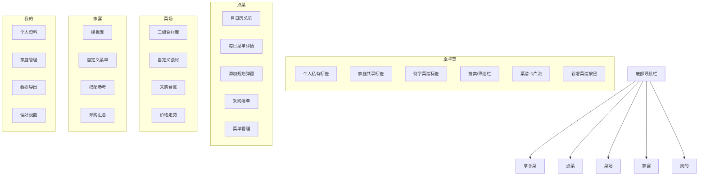
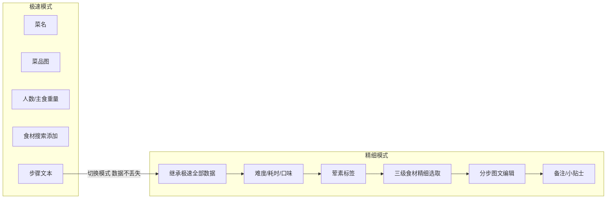
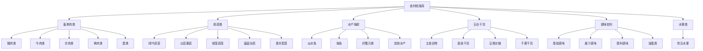

# 家庭私厨小程序 - 完整需求文档


---

## 一、项目总览

**项目名称**：家庭私厨小程序（家庭共享菜谱 + 智能买菜 + 家宴定制一体化工具）

**核心定位**：专为家庭打造的私有菜谱知识库、食材采购台账、家宴配菜系统。主打家庭私有化、数据可沉淀、配比精准、采购自动汇总、多人家庭共享。

**核心特质**：所有功能极简、轻量化、无广告、无冗余社区，纯工具属性，完全服务自家厨房。

---

## 二、全局核心底层逻辑

所有功能依赖此规则，不可改动。

### 2.1 身份与数据隔离体系



**登录方式**：微信静默授权登录，自动获取 OpenID，无需手动注册、无需手机号、无登录弹窗打扰，打开即用。

**数据三层隔离机制**（绝对隔离、互不串数据）：

| 层级 |可见范围 | 编辑权限 |
|------|--------- |---------|
| 个人私有 |仅本人 | 仅本人 |
| 家庭共享 |同家庭所有成员 | 全员协同编辑 |
| 系统公共 |全体用户 | 仅平台 |

**家庭体系**：以 tenantId 为唯一家庭标识，一个家庭对应一组独立共享数据。

**权限规则**：

| 角色 |权限范围 |
|------|--------- |
| 户主（创建者） |最高权限：管理成员、删除共享数据、解散家庭、修改家庭信息 |
| 普通成员 |可新增、编辑、使用家庭数据，不可删除核心数据、不可管理成员 |

---

### 2.2 用量换算核心算法



**规则说明**：

1. 人数换算模式（默认通用）：根据用餐人数自动精准换算所有食材、配菜、调料用量，适配95%日常场景。
2. 主食精准换算模式（独家核心）：用户填入主食实际重量后，系统强制优先以主食重量为唯一基准，重新配比所有食材和调料。
3. 优先级铁规：主食重量填写大于用餐人数换算。
4. 全局智能记忆：自动记忆常用人数、主食配比、调料偏好，新建菜谱时自动回填。

---

### 2.3 全局 UI 视觉规范

| 维度 |规范 |
|------|------ |
| 整体风格 |治愈可爱漫画风、低饱和马卡龙配色、温柔奶系色调 |
| 组件规范 |超大圆角、软性阴影、高留白、无边框轻量化卡片 |
| 素材规范 |所有图片统一透明底漫画风PNG素材，禁止实景图 |
| 动效规范 |弹窗上浮弹出、按钮点击微回弹、页面淡入淡出 |

#### 风格方向：温馨食谱

| 维度 |规范 |
|------|------ |
| 主色调 |陶土棕 #8b5e3c · 辅助色暖米 #f7f2eb |
| 标题字体 |Noto Serif SC / Songti SC（衬线体，有书籍感） |
| 正文字体 |Noto Sans SC / PingFang SC（无衬线，阅读舒适） |
| 卡片风格 |14px 圆角 · 1.5px 细边框 · 微阴影 |
| 按钮风格 |24px 大圆角 · 实心主色 |
| 整体气质 |温暖、安静、克制，像一本家庭食谱书 |

| 适配规范 |全机型自适应，iOS/Android 样式统一 |

---

## 三、底部 Tab 五大主页面

固定排序、固定布局，不可增减修改。顺序：拿手菜 -> 点菜 -> 菜场 -> 家宴 -> 我的

**底部Tab导航栏**：五个Tab固定在页面底部，所有页面均显示，切换Tab时对应页面内容切换，导航栏本身不消失、不隐藏。

### 3.0 导航结构



### 3.1 拿手菜（核心主页）

**定位**：用户所有自制菜谱的沉淀仓库，个人私有、家庭共享双向隔离。

#### 顶部栏布局

| 区域 |内容 |
|------|------ |
| 左上角 |用户名展示 |
| 右上角 |搜索框 + 视图切换图标 + 浏览全部图标 + 菜品总数 |

#### 视图切换

支持三种布局模式，用户通过顶部图标切换：

| 模式 |图标样式 | 说明 |
|------|--------- |------|
| 一行两个 |2×2 田字格 | 卡片网格，默认模式 |
| 一行三个 |3×3 田字格 | 缩小卡片，一屏展示更多菜 |
| 列表形式 |☰ 三横线 | 紧凑文字列表，无菜品图 |

#### 展示模式

| 模式 |说明 |
|------|------ |
| 图片版 |默认展示，卡片包含菜品图 + 菜名 + 难度 + 用时 + 标签 |
| 文字版 |单独页面，纯文字列表，无菜品图片，适合快速浏览全部菜品 |

文字版为独立页面，可通过顶部或菜单入口切换进入。

#### 菜品总量

在标签栏或页面顶部显示：**共 X 道菜**，实时更新。

#### 页面层级

拿手菜首页

- 顶部栏
  - 左上角：[用户名]
  - 右上角：[🔍 搜索框] [视图切换图标] [🔎 浏览全部图标] [共 X 道菜]
- 标签切换：[个人私有] [家庭共享] [待学菜谱]
- 分类栏：[全部/肉类/蔬菜/海鲜/素面食/汤类/饮品/甜品/❤收藏] [▸管理]
- 主内容区（三种视图模式）
  - 一行两个 / 一行三个 / 列表形式
- 底部固定 [+ 新增菜谱] 按钮

子页面一：菜品详情页
- 顶部操作栏：[← 返回] 菜名 [编辑] [导出海报] [共享]
- 菜品大图展示（可点击更换）
- 元信息区：烹饪时间 / 难度 / 口味标签 / 收藏状态
- 用量调整：主料重量可调（[-] [+] 输入框），所有配料自动按比例换算
- 食材清单：标签样式展示所有食材及用量
- 分步图文步骤：编号 + 文字 + 每步配图
- 备注 & 小贴士
- 底部操作行一：[编辑] [复制新建] [删除]
- 底部操作行二：[导出海报] [更换图片：图库/拍照/AI]

子页面二：新增菜品页
- 点击底部"新增菜谱"按钮跳转，全屏独立页面
- 顶部：[← 返回] 新增菜谱
- 双模式切换：[极速模式] [精细模式]
- 表单字段详见第四章
- 底部：[保存] [保存草稿]

子页面三：分享海报页
- 从详情页"导出海报"或浏览全部进入
- 顶部：[← 返回] 分享海报
- 海报预览区（展示当前菜品精美海报）
- 菜品快速切换（左右滑动或下拉选择）
- 操作：[保存到手机相册] [分享微信好友] [分享朋友圈]

#### 核心功能

- 新增/编辑菜谱弹窗（双模式录入，详见第四章）
- AI 一键生成漫画风菜品图

#### 图片来源策略

**菜品图片**（用户自制菜品的配图）：
- **拍照**：用手机相机拍摄做好的菜品（最真实）
- **从相册选**：从手机相册选择已有照片
- **AI 生成**：根据菜名自动生成漫画风菜品图
- **自动搜图**：技术上可实现但存在版权风险和图片质量不可控问题，暂不支持

**食材图片**（食材档案库中番茄、排骨等）：
- 使用统一 emoji 图标（🍅🥩🥬🍚🧂），轻量且不侵权
- 后期可批量生成一套AI漫画风食材图标替换
- 无需真实照片

- 菜品图片可随时编辑替换（三渠道：手机图库选图 / 相机拍照 / AI 重新生成，可直接在详情页底部操作栏切换）
- 菜谱共享开关：私有保存 / 共享家庭
- 菜谱全操作：复制新建、编辑、删除、收藏
- 多维度搜索 + 筛选
- 菜品收藏：每道菜品可收藏，分类栏「收藏」标签筛选已收藏菜品
- 菜品分类筛选：肉类 / 蔬菜 / 海鲜 / 素面食 / 汤类 / 饮品 / 甜品
- 分类管理：自定义新增分类 / 排序调整 / 隐藏显示
- 菜谱状态流转：拿手菜 <-> 待学菜谱（双向）
- 导出海报：独立分享海报页，支持保存到相册、分享微信好友/朋友圈，可切换其他菜品海报
- 三种视图布局自由切换（一行两个 / 一行三个 / 列表形式）
- 图片版与文字版双模式查看
- 浏览全部入口（顶部图标）：进入后切换图片版/文字版、导出海报
- 菜品总量实时统计显示（顶部栏右上角）


#### 待学菜谱（学做新菜）

**定位**：从互联网或家人分享收集的待学菜品清单，与拿手菜形成"已掌握/学习中"的双向流转闭环。

**入口**：拿手菜页顶部标签「待学菜谱」，与「个人私有」「家庭共享」同级切换。

**页面结构**：

- 顶部标签栏：[待学菜谱] 统一标签，切换时保持筛选栏和分类栏状态
- 内容区展示待学菜谱列表（支持三种视图布局，与拿手菜完全一致）
- 底部固定 [+ 新增待学] 按钮

**数据来源与导入方式**：

| 方式 |操作 | 说明 |
|------|------ |------|
| ✏️ 手动新增 |填写菜名 + 来源链接/备注 | 基础方式，随时可新建 |
| 🔄 从拿手菜移出 |标记「还没做熟练」 | 自动从拿手菜移入待学列表 |
| 📤 **微信分享导入** |看到菜谱 → 分享 → 选择「家庭私厨」小程序 | 自动抓取菜名、食材列表、步骤文字，一键存入待学菜谱或直接编辑保存 |
| 📋 **粘贴导入** |复制菜谱全文 → 进小程序粘贴 | 系统自动识别菜名、食材清单、步骤，填入编辑页确认后保存 |
| 📸 **拍照识别**（高阶） |菜谱书拍照上传 | OCR 识别文字，自动解析填入编辑 |


**状态与流转规则**：

| 操作 |流转结果 |
|------|--------- |
| 待学菜谱 → 已学会 |点击"学会"，自动移至拿手菜（个人私有），保留原菜名和备注 |
| 拿手菜 → 不熟练 |标记"不熟练"，从拿手菜移入待学列表，保留所有数据 |
| 待学菜谱 → 删除 |从待学列表移除 |
| 待学菜谱 → 编辑 |编辑菜名、来源链接、备注 |

**待学列表操作**：
- 查看详情（菜名 + 来源 + 备注）
- 快速标记为"已学会"（弹出确认，询问是否录入完整菜谱信息）
- 删除
- 一键复制菜名生成极速菜谱录入

**分类归属**：待学菜谱不支持分类标签、不支持收藏、不参与菜谱换算和采购汇总。

**数据范围**：待学菜谱仅限个人私有，不共享到家庭。

---

#### 搜索体系

**定位**：贯穿全站的统一搜索入口，支持多维度检索和实时筛选联动。

**搜索入口**：
- 拿手菜顶部栏常驻搜索框
- 菜场食材库顶部搜索框
- 全局搜索入口（我的页面）

**搜索维度**（拿手菜场景）：

| 维度 |说明 | 示例 |
|------|------ |------|
| 菜名关键词 |模糊匹配菜品名称 | 搜索"红烧"找到红烧肉、红烧排骨 |
| 食材名 |搜索包含该食材的菜品 | 搜索"鸡蛋"找到所有含蛋菜品 |
| 标签 |按口味/荤素/分类搜索 | 搜索"麻辣"或"素菜" |
| 步骤内容 |搜索步骤描述中的关键词 | 搜索"焯水"找到含此步骤的菜 |
| 备注/小贴士 |搜索备注内容 | 搜索"替代"找到有替代方案的菜 |

**搜索结果页行为**：
- 保持顶部搜索框 + 搜索结果列表（三种视图切换）
- 结果显示匹配数量：「找到 X 道菜」
- 搜索无结果时展示空状态插画 + 引导提示
- 搜索结果支持二次筛选（按分类/标签/荤素/难度）
- 清空搜索框即返回全量列表

**搜索与筛选联动规则**：
- 搜索 + 分类筛选：在搜索结果范围内按分类进一步缩小
- 搜索 + 标签筛选：在搜索结果范围内按标签进一步缩小
- 搜索 + 排序：支持按时间/热度/字母排序


> 修订（v3.0）：补充了待学菜谱完整功能模块、搜索体系细则、全局页面状态设计、核心数据模型、AI智能能力详解、技术栈与架构建议。修复了3.1节菜品详情页重复描述的问题。

### 3.2 点菜（月菜单规划 + 智能采购汇总）

**定位**：家庭每月用餐规划工具，按月日历规划三餐，自动汇总采购清单。

**导航方式**：点菜页面内设底部双导航 [月视图] / [周视图]，可在月日历总览与每日详情间切换。

---

#### 点菜首页（月视图）

- **月日历总览**
  - 全月日历展示，支持左右滑动切换前后月
  - 已规划菜品的日期自动标注小圆点（绿=早餐、橙=午餐、紫=晚餐）
  - 当天日期高亮，显示早餐/午餐/晚餐的规划状态
  - 点击任意日期 → 进入该日菜单详情页（周视图）
  - 顶部操作栏：[← 返回拿手菜] [今天] [采购清单] [菜单管理]
  - 日历下方显示：「本月共规划 X 餐 · Y 道菜」

- **今日餐食（日历底部固定卡片区）**
  - 🌅 早餐：显示今日已选菜名列表，每道菜带 emoji 图标标签
  - ☀️ 午餐：同上
  - 🌙 晚餐：同上，空状态显示「暂无安排」
  - 点击任意餐段跳转至该日日详情页
  - 每道菜以标签样式展示，白色底+圆角边框，专业可视

- **今日打卡**
  - 日历底部右侧固定区域
  - 显示：📅 未打卡 / 已打卡
  - 点击「打卡」按钮标记今日完成（按钮变绿+累计天数+1）
  - 显示连续打卡天数：🔥 X 天

---

#### 子页面一：每日菜单详情（周视图）

- 进入方式：点击日历日期 / 底部「周视图」导航 / 点击今日餐食卡片
- 进入时自动定位到所选日期
- 顶部日期栏：显示当前日期 + 星期几
- **周视图星期滚动条**（左右滑动）
  - 显示该日所属周的全部7天（星期一 → 星期日）
  - 每天显示日期数字 + 底部绿/橙/紫圆点标注三餐规划情况
  - 当前选中日期高亮（橙色底）
  - 今天用浅橙色边框标记
  - 左右滑动可切换前后周
- **三餐分段卡片区**
  - 🌅 早餐（06:30-08:30）：已选菜品横向滑动卡片展示 + [+ 添加] 按钮
  - ☀️ 午餐（11:30-13:00）：同上
  - 🌙 晚餐（17:30-19:30）：同上，空状态显示「还没有安排，点这里添加」
  - 每个菜品卡片：菜品 emoji 缩略图 + 菜名 + 难度 · 用时
  - 卡片右上角小圆点可点击切换「已完成」状态（半透明+删除线）
  - 勾选后该餐段计数自动更新
- **底部操作**
  - [+ 添加]：打开添加规划弹窗
  - [复制]：复制本日三餐所有菜品到剪贴板，按钮闪「已复制」
  - [粘贴]：复制后出现，将已复制的菜单粘贴到当前日期
  - [清空]：清空当日所有菜品，恢复空状态

---

#### 子页面二：添加规划弹窗（底部弹出层）

- **触发**：点击任意餐段的「+ 添加」按钮
- **布局**：底部圆角弹出层，毛玻璃遮罩背景
- **标题**：「添加 · [早餐/午餐/晚餐]」
- **数据源**：默认展示当前用户拿手菜列表
- **标签切换**：[个人私有] / [家庭共享]
- **分类筛选栏**：[全部/肉类/蔬菜/海鲜/素面食/汤类/饮品/甜品]
- **菜品选择**：列表展示，每行：emoji 缩略图 + 菜名 + 难度 + ✅ 勾选框
- **多选**：可同时选中多道菜统一添加
- **操作按钮**（弹窗底部固定）：

  | 操作 |行为 |
  |------|------ |
  | [确认添加] |将勾选菜品加入当前餐段卡片列表，替换空状态 |
  | [随机] |自动从拿手菜中随机勾选 2 道菜，可重新随机 |
  | [手动输入] |弹出输入框，输入菜名直接加入（标「临」标签，不入拿手菜库） |
  | [取消] |关闭弹窗，不保存 |

- 菜品加入规则：按餐段分组加入，每个餐段最多容纳不限道菜
- 支持重复添加同一道菜

---

#### 子页面三：采购清单

- **入口**：月日历顶部「采购清单」按钮
- **功能**：自动解析当前显示周期内所有已规划的菜品
- **食材拆解**：根据菜谱中的食材配比，按用餐人数换算实际需要量
- **展示方式**：按食材三级分类规整排序（畜禽肉/蔬菜/水产/五谷/调味/水果）
- **每项显示**：
  - 食材名称 + 需要量（克/个/毫升）
  - 预估单价（取最近一次采购价）
  - 预估总价
  - 上次采购价（供对比）
- **操作**：[保存清单] [分享给家人] [导出Excel]
- **切换周期**：本月 / 本周 / 自定义日期范围
- **联动**：点击食材名称跳转菜场该食材详情页（查看历史价格/走势/采购记录）

---

#### 子页面四：菜单管理

- **入口**：月日历顶部「菜单管理」按钮
- **功能**：已保存的月菜单历史列表，按月展示
- **操作**：[重命名] [删除] [分享月菜单]
- **复用**：一键复制整套月菜单到下月

---

#### 点菜与菜场联动

- 采购清单中的食材直接关联菜场食材档案库
- 点击食材跳转菜场详情页，查看该食材：
  - 当前市场价（最近一次采购价）
**采购账本**：详细内容已移至 3.3 菜场 → 采购账本。

#### 页面对局

**顶部**：日期范围选择器（[本周] [本月] [自定义]） + 右侧「导出」按钮

**总览卡片区**（三张并列卡片）：

```
┌──────────┐ ┌──────────┐ ┌──────────┐
│  💰 总支出  │ │  🛒 采购次数 │ │  📊 日均  │
│  ¥1,285   │ │    28次   │ │  ¥42.8   │
│ ───────── │ │ ───────── │ │ ───────── │
│  上月+12%  │ │  上周+3次  │ │  上月+5.2 │  ← 绿色涨/红色跌
└──────────┘ └──────────┘ └──────────┘
```

**趋势折线图**（主力图表）：
- 横轴：日期（按天）
- 纵轴：花费金额
- 折线 + 面积填充渐变
- 可手指滑动查看每天的具体数值
- 支持双指缩放查看更细粒度

**分类饼图/环形图**：
- 展示该时间段内各食材大类的花费占比
- 例：畜禽肉类 45% · 鲜蔬类 25% · 水产 15% · 调味 10% · 其他 5%
- 点击某一块 → 筛选只看该分类的采购明细
- 交互：点击切换饼图/柱状图

**每日明细列表**：
- 按日期排列，每行：日期 + 该日总花费
- 展开后展示该日所有采购条目（食材、单价、数量、总价）
- 支持下拉加载更多

**价格波动热力图**（进阶）：
- 横轴：食材分类
- 纵轴：时间
- 色块深浅表示价格高低
- 一眼看出哪些食材近期涨价

**操作**：
- [切换视图] — 列表视图 / 图表视图
- [导出Excel] — 包含全部明细数据
- [分享图片] — 生成账本截图分享给家人
- [对比上期] — 折叠展开上周/上月对比数据
#### 采购价格提醒

**规则**：录入采购价格时，系统自动比对历史均价。

| 情况 |行为 |
|------|------ |
| 高于历史均价 × 1.15 |弹窗提醒 + 展示该食材最近 10 次采购记录（日期+单价），供确认是否录入 |
| 等于或低于历史均价 |正常录入，无需提醒 |
| 首次录入（无历史数据） |直接录入，无需提醒 |

**提醒弹窗内容**：该食材近10次采购记录表（日期、单价、总价、购买地点），让用户对比后决定是否以当前价格录入。

  - 历史价格走势图
  - 最近采购记录
- 采购清单的预估价格取自菜场的历史采购数据
- 闭环：规划 → 清单 → 采购录入 → 价格沉淀 → 下次清单更准

### 3.3 菜场（食材数据中心 + 采购台账系统）

**定位**：全系统食材数据库、个人买菜记录台账、价格走势记录、常用食材快捷采购。

---

#### 导航结构

菜场首页顶部标签切换：
- **[❤️ 我的常买]**（默认首页）— 用户常用食材快捷列表
- **[📂 全部分类]** — 系统六级大类逐级展开

底部操作：[+ 新增自定义食材]

---

#### 页面一：我的常买（默认首页）

**定位**：日常买菜最常用入口。展示用户标记为「常买」的食材，点击即可录入采购。

**列表展示**：
- 每行：食材名称 + emoji + 上次购买单价 + 上次购买日期
- 按使用频率排序，最常用的排前面
- 空状态：第一次使用时展示「还没有常买食材，去全部分类添加 ❤️」

**交互**：
- 点击任意食材 → 自动弹出采购录入弹窗（食材名称已填好）
- 左滑/长按 → 删除出「我的常买」
- 右上角[管理]按钮 → 批量删除、排序

**数据来源**：
- 从「全部分类」中点❤️添加
- 采购录入时勾选「加入常买」
- 系统自动记录采购频率，常用食材靠前

---

#### 页面二：全部分类（三级逐级展开）

**定位**：系统完整食材库，按六级大类逐级浏览，可按关键词搜索。

**布局**：

```
一级大类（6类，默认展开）
  ├── ▶ 畜禽肉类  [→]
  │   ├── 猪肉类  [→]
  │   │   ├── 五花肉     ❤️
  │   │   ├── 里脊肉     ❤️
  │   │   ├── 排骨       ❤️
  │   │   └── ...        ❤️
  │   ├── 牛肉类  [→]
  │   └── ...
  ├── ▶ 鲜蔬类    [→]
  ├── ▶ 水产海鲜  [→]
  ├── ▶ 五谷干货  [→]
  ├── ▶ 调味佐料  [→]
  └── ▶ 水果类    [→]
```

**交互**：
- 点击一级大类 → 展开二级分类列表
- 点击二级分类 → 展开三级具体食材
- 每项食材右侧 ❤️ 按钮，点一下加入「我的常买」（高亮表示已添加）
- 点击食材名称 → 跳转食材详情页（价格走势、采购记录）
- 顶部搜索框 → 关键词实时搜索，穿透全部三级

**分类排序**（固定，不可变）：
畜禽肉类 → 鲜蔬类 → 水产海鲜 → 五谷干货 → 调味佐料 → 水果类

**食材自定义**：
- 底部 [+ 新增自定义食材] → 弹出表单：名称 + 上级分类 + emoji
- 自定义食材归入「个人食材」标签，可编辑/删除

---

#### 子页面一：食材详情页

**入口**：全部分类中点击具体食材名称

**展示内容**：
- 顶部：食材名 + emoji + ❤️ 常买按钮
- 当前市场价（最近一次采购单价）
- **历史价格走势图**（折线图，横轴日期，纵轴单价）
  - 默认展示最近 30 天
  - 可切换 7天 / 30天 / 90天 / 全部
- **最近采购记录**（列表）
  - 每行：日期 + 单价 + 数量 + 总价 + 购买地点
  - 按月/按季度筛选
- 操作：[录入采购] [加入常买] [编辑食材]

---

#### 子页面二：采购录入弹窗

**触发**：我的常买点食材 / 食材详情页点「录入采购」/ 采购台账点「+ 新增」

**布局**：

```
┌──────────────────────────────┐
│          录入采购记录           │
│  ┌────────────────────────┐  │
│  │ 🎤 按住说话，说例如      │  │
│  │  「番茄一斤五元」       │  │  ← 语音录入区
│  └────────────────────────┘  │
│                              │
│  食材名称    [番茄 🍅  ▼]    │  ← 手动选
│  采购日期    [2026-06-12 📅] │
│  单    价    [  5.00  ] 元/斤│
│  数    量    [  2.00  ] 斤   │
│  总    价    [  10.00 ] 元   │  ← 自动计算
│  购买地点    [菜市场 ▼]      │  ← 可选
│  备    注    [____________]  │  ← 可选
│  ☐ 加入我的常买              │
│                              │
│   [取消]    [保存并继续]     │
└──────────────────────────────┘
```

**语音录入**（微信同声传译插件）：
- 点 🎤 按钮 → 开始录音 → 说完自动识别
- 识别结果解析：提取食材名、数量、单价
- 自动填入对应字段，用户确认后保存
- 识别不准可手动修正

**交互**：
- 单价/数量任一变化 → 总价自动重算
- 食材名称下拉选 → 从食材档案库匹配（支持模糊搜索）
- 「保存并继续」→ 保存当前记录不清空弹窗，直接录下一条
- 「加入我的常买」勾选 → 保存后自动将该食材加入「我的常买」

---

#### 子页面三：采购记录台账

**入口**：菜场顶部或底部「采购台账」

**展示**：
- 按时间倒序展示所有采购记录
- 每行：日期 + 食材 + 单价 + 数量 + 总价
- 按月/按季度筛选
- 操作：[导出 Excel] [搜索记录] [删除单条]

---

#### 采购价格提醒

**规则**：录入采购价格时，系统自动比对历史均价。

| 情况 |行为 |
|------|------ |
| 高于历史均价 × 1.15 |弹窗提醒 + 展示该食材最近 10 次采购记录（日期+单价），供确认是否录入 |
| 等于或低于历史均价 |正常录入，无需提醒 |
| 首次录入（无历史数据） |直接录入，无需提醒 |

**提醒弹窗内容**：展示该食材近10次采购记录表（日期、单价、总价、购买地点），用户对比后决定是否以当前价格录入。

---

#### 与点菜的联动

- 点菜生成的「采购清单」中每项食材直接关联菜场食材档案
- 点击食材名称跳转菜场食材详情页（看价格走势和历史采购）
- 采购清单的预估价格取自菜场的历史采购数据
- 闭环：规划 → 清单 → 采购录入 → 价格沉淀 → 下次采购清单更准

---

#### 进阶功能

##### 1. 采购清单同步

**入口**：菜场首页顶部「采购清单」按钮（与点菜联动）。

**交互**：
- 打开后展示当前周期的采购清单（自动来自点菜规划）
- 每项食材显示：名称 + 需要量 + 已买量 + 状态
- 状态标记：[未买] / [已买] / [部分购买]
- 点击「已买」→ 自动弹出该食材的采购录入弹窗，数量默认填清单需要量
- 全部买完显示 ✓ 全部采购完成
- 操作：[刷新清单] [同步点菜] [分享给家人]

**数据来源**：点菜模块生成的采购清单，按三级分类规整。

---

##### 2. 每月采购预算

**入口**：菜场设置 / 采购账本顶部。

**功能**：
- 设置每月预算上限（例如 ¥3,000）
- 账本顶部进度条：本月已花 ¥1,285 / ¥3,000（42%）
- 进度条分段颜色：绿色（<60%）→ 黄色（60-85%）→ 红色（>85%）
- 超 90% 时推送提醒：「本月买菜预算已用 90%，请注意控制」
- 可在「我的 → 偏好设置」中修改预算金额

---

##### 3. 食材库存管理

**入口**：菜场首页新增标签「🧊 冰箱库存」。

**核心规则**：根据食材默认储存方式区分库存提醒行为。只有「需冷藏/冷冻」的食材才触发保质期提醒，「常温存放」的食材只记录余量，不触发提醒。

**食材储存分类**（系统预设，关联食材档案库三级分类）：

| 储存方式 |包含食材分类 | 保质期提醒 |
|---------|------------ |-----------|
| 🧊 **冷藏** |畜禽肉类、蛋类、绿叶蔬菜、瓜茄果蔬、菌菇杂蔬、部分水果 | 触发 |
| ❄️ **冷冻** |冷冻肉品、冷冻海鲜、部分水产 | 触发 |
| 🏠 **常温** |根茎蔬菜（土豆/胡萝卜/山药）、五谷干货、调味佐料、香辛配菜（葱姜蒜）、水果类 | 不触发 |

**功能**：
- 采购录入时默认勾选「入库冰箱」，自动记录食材 + 数量 + 购买日期
- 系统根据食材的三级分类自动判定储存方式（冷藏/冷冻/常温）
- 用户可手动修正储存方式
- **冰箱库存列表**：食材名 + 剩余量 + 存放天数 + 储存方式标识（🧊/❄️/🏠）
- **到期提醒**：仅对冷藏/冷冻食材生效
  - 存放超过建议期限的食材标红，显示「已存放 X 天，建议尽快食用」
  - 常温食材仅显示余量，不提醒
- **手动出库**：吃完后可手动减少数量或删除

**食材保质期参考**（系统预设，仅冷藏/冷冻类）：

> **v1.0 简化方案**：保质期按食材大类预设默认值（如上表），不针对单个食材独立配置。用户可在偏好设置中手动微调天数。后期迭代再支持逐食材自定义。
>

| 食材类型 |建议存放天数 |
|---------|------------ |
| 绿叶蔬菜 |2-3 天 |
| 瓜茄果蔬 |3-5 天 |
| 猪肉/牛肉（冷藏） |2-3 天 |
| 鱼类（冷藏） |1-2 天 |
| 鸡蛋 |14-21 天 |
| 冷冻肉品 |30-90 天 |
| 菌菇类 |3-5 天 |
| 豆腐/豆制品 |2-3 天 |

**提示文案示例**：
- 冷藏食材到期：「🥬 上海青已存放 4 天，建议今天食用」
- 冷冻食材：「🥩 排骨（冷冻）已存放 35 天」
- 常温食材：「🥔 土豆 · 常温存放 · 余量 3 斤」（仅显示，无提醒）

**与点菜联动**：规划菜品时若有库存食材，自动提示「排骨冰箱还有 500g，本次可减量购买」。
##### 4. 价格对比

**入口**：食材详情页新增「📍 价格对比」标签。

**功能**：
- 记录购买地点（菜市场 / 超市 / 线上 / 其他）
- 自动统计该食材在不同地点的平均价格
- 展示对比表格：

```
食材：番茄 🍅
┌──────────┬──────┬──────┐
│ 购买地点  │ 均价  │ 最近价 │
├──────────┼──────┼──────┤
│ 菜市场    │ ¥4.5 │ ¥5.0 │
│ 超市      │ ¥5.8 │ ¥6.0 │
│ 线上      │ ¥4.2 │ ¥4.5 │
└──────────┴──────┴──────┘
推荐去：线上下单（均价最低 ¥4.2）
```

- 采购录入时「购买地点」下拉选，可选已有地点或新增

---

##### 5. 采购频率分析

**入口**：采购账本内新增「📊 采购分析」标签。

**功能**：
- TOP10 食材排行榜（按采购次数 / 按总花费）
- 展示：排名 + 食材名 + 采购次数 + 总花费 + 占比
- 时间范围切换：近 1 月 / 近 3 月 / 近 1 年
- 可视化：排行柱状图，一眼看出家庭饮食习惯
- 数据说明：「你家买得最多的排骨，3 个月花了 ¥580」
### 3.4 家宴（宴席智能定制 + 精美菜谱分享）

**定位**：解决家庭聚餐不会配菜、荤素失衡、份量不准的痛点。智能生成宴席菜单，输出精美菜谱图分享给客人。

---

#### 核心流程

```
选择场合 → 选模板 / 自定义 → 配菜（智能/手动/随机）→ 预览调整 → 生成精美菜谱 → 分享
```

---

#### 家宴首页

**场景选择区**（顶部横向滚动卡片）：

| 场景 |默认人数 | 推荐菜式结构 |
|------|--------- |-------------|
| 🏠 家常小聚 |4人 | 2凉 + 3热 + 1汤 |
| 💑 双人简餐 |2人 | 1凉 + 2热 + 1汤 |
| 🎉 朋友聚餐 |6人 | 3凉 + 5热 + 1汤 + 1甜品 |
| 👴 长辈宴请 |8人 | 4凉 + 6热 + 2汤 + 1甜品 |
| 🎄 节日正餐 |10人 | 4凉 + 8热 + 2汤 + 2甜品 |
| 🧧 年夜饭 |12人 | 6凉 + 10热 + 3汤 + 2甜品 |

点击场景 → 进入该场景的模板列表页。

**底部操作**：
- [🎲 随机一桌] — 系统自动从拿手菜中随机配一桌完整的菜
- [✏️ 自定义创建] — 自由配菜

---

#### 菜品分类体系（宴席专用）

每道菜在宴席场景中多一个「宴席分类」标签：

| 分类 |说明 | 示例 |
|------|------ |------|
| 🥟 凉菜/冷盘 |冷食、开胃菜 | 凉拌黄瓜、口水鸡、皮蛋豆腐 |
| 🍲 热菜（荤） |主菜肉类 | 红烧排骨、糖醋里脊、清蒸鲈鱼 |
| 🥬 热菜（素） |素菜/时蔬 | 清炒时蔬、地三鲜、蒜蓉西兰花 |
| 🥣 汤羹 |汤类 | 番茄蛋汤、排骨汤、酸辣汤 |
| 🍚 主食 |米饭/面食 | 白米饭、馒头、炒面 |
| 🍰 甜品/饮品 |餐后甜点/饮料 | 红豆沙、水果拼盘、酸梅汤 |

每一道从拿手菜添加时自动继承宴席分类（系统根据食材/口味推断，用户可手动改）。

---

#### 智能配菜逻辑

**规则引擎**（一桌好菜的核心）：

| 维度 |规则 |
|------|------ |
| 荤素比 |荤菜 60% + 素菜 40%（可调） |
| 冷热比 |凉菜 30% + 热菜 60% + 汤 10% |
| 口味搭配 |至少包含：咸鲜、酸甜、辣味各一道 |
| 食材不重复 |同一桌不出现重复主食材 |
| 烹饪方式 |煎炒蒸煮烤各有分布，不全部同一种做法 |
| 按人数算量 |每道菜的分量自动按人数换算（复用用量换算算法） |

**三种配菜模式**：

| 模式 |行为 |
|------|------ |
| 🎲 **一键随机** |系统从拿手菜全库按规则随机抽，不满意可重新随机 |
| 🤖 **智能推荐** |系统根据场景模板 + 规则引擎推荐最适配的菜品组合 |
| ✏️ **手动挑选** |用户从拿手菜库中按分类自行选菜，系统实时提示搭配建议 |

---

#### 子页面一：创建宴席（全屏编辑器）

**顶部**：
- 宴席名称：[请客吃饭 2026.6.12]（可改）
- 用餐人数：[8]（滑动选择器）
- 日期：[2026-06-12]
- 场合标签：[朋友聚餐 ▼]

**菜品编排区**（按宴席分类分块，点击→上移/下移 按钮调整顺序（v1.0 暂不支持拖拽））：

```
┌─────────────────────────────┐
│ 🥟 凉菜/冷盘（2道）         [+ 添加] │
│ ┌──────┐ ┌──────┐           │
│ │口水鸡│ │凉拌黄瓜│          │  ← 可拖拽排序
│ └──────┘ └──────┘           │
├─────────────────────────────┤
│ 🍲 热菜·荤（4道）          [+ 添加] │
│ ┌──────┐ ┌──────┐ ┌──────┐  │
│ │红烧排│ │清蒸鱼│ │宫保鸡│  │
│ └──────┘ └──────┘ └──────┘  │
├─────────────────────────────┤
│ 🥣 汤羹（1道）              [+ 添加] │
│ ┌──────┐                     │
│ │排骨汤│                     │
│ └──────┘                     │
├─────────────────────────────┤
│ 🍰 甜品/饮品（1道）          [+ 添加] │
│ ┌──────┐                     │
│ │水果盘│                     │
│ └──────┘                     │
└─────────────────────────────┘
```

**交互**：
- 点击[+ 添加] → 从拿手菜库选取（可按宴席分类筛选）
- 长按拖拽 → 调整菜品顺序
- 点击菜品 → 替换成其他菜
- 滑动删除 → 移除该菜
- 右侧智能提示：❓ 建议再来一道素菜 / ❓ 缺一道汤 / ❓ 荤素比已达标

**底部信息**：
- 总菜品数：8 道 ｜ 荤：5 ｜ 素：3 ｜ 人均约 ¥35
- 操作：[🎲 重新随机] [👁️ 预览菜谱] [💾 保存宴席]

---

#### 子页面二：精美菜谱预览（核心亮点）

**进入**：编辑器点「预览菜谱」

**预览页布局**（手机全屏，菜谱风格）：

```
┌─────────────────────────────┐
│  🎉 朋友聚餐 · 8人宴        │  ← 标题
│  2026年6月12日 星期六        │
├─────────────────────────────┤
│     —— 凉菜 ——              │
│  口水鸡        麻辣         │
│  凉拌黄瓜      清爽         │
│                             │
│     —— 热菜 ——              │
│  红烧排骨      咸鲜         │
│  清蒸鲈鱼      鲜美         │
│  宫保鸡丁      麻辣         │
│  蒜蓉西兰花    清淡         │
│                             │
│     —— 汤羹 ——              │
│  玉米排骨汤    鲜美         │
│                             │
│     —— 甜品 ——              │
│  水果拼盘      清甜         │
├─────────────────────────────┤
│  📊 食材清单：16种食材      │
│  💰 预估花费：约 ¥280       │
│  ⏱ 预计烹饪时间：2.5小时    │
│                             │
│  [💾 保存] [📸 分享图片]     │
└─────────────────────────────┘
```

**菜谱风格切换**（三种模板）：

| 风格 |色调 | 适用 |
|------|------ |------|
| 🏮 中式典雅 |红金配色、祥云底纹 | 年夜饭、长辈宴请 |
| 🌿 清新简约 |白绿配色、留白多 | 朋友聚餐、日常 |
| 🌸 温馨手绘 |暖色卡纸质感、手写字体 | 家庭聚会、双人 |

**分享功能**：
- [📸 生成图片] — 渲染成高清长图，保存到手机相册
- [📱 分享微信好友] — 直接调起微信分享
- [📋 复制文本] — 复制成文字版菜单

---

#### 子页面三：官方模板库

**内置模板**（持续更新）：

| 模板 |适用 | 菜式结构 |
|------|------ |---------|
| 🏮 经典年夜饭 |除夕团圆 | 6凉 + 10热 + 3汤 + 2甜品 |
| 🎉 朋友聚餐 |好友聚会 | 3凉 + 5热 + 1汤 + 1甜品 |
| 👴 孝心家宴 |长辈生日/节日 | 4凉 + 6热 + 2汤（清淡为主）|
| 💑 浪漫双人 |二人世界 | 1凉 + 3热 + 1甜品 |
| 🌿 素食宴 |健康饮食 | 3凉 + 5素热 + 1汤 |
| 🧊 夏日清爽 |消夏聚会 | 4凉 + 4热 + 1汤 + 1冷饮 |
| 🍲 火锅宴 |围炉聚 | 锅底 + 8配菜 + 2蘸料 + 2饮品 |

点击模板 → 进入预览页 → [套用] → 进入编辑器可微调。

---

#### 子页面四：我的宴席（菜单管理）

- 已保存的宴席菜单列表（卡片展示，含名称、日期、人数、菜品数）
- 操作：[预览菜谱] [编辑] [改名] [删除] [分享]

---

#### 子页面五：采购汇总

- 从宴席菜单「生成采购清单」进入
- 全套菜品食材一键汇总，按三级分类规整
- 自动按人数换算用量
- 直接跳转菜场 / 加入采购清单
### 3.5 我的（个人中心 + 全局设置 + 权限管理）

**定位**：全系统数据总控、权限管理、个性化配置、数据导出中心。

**页面层级**：

我的首页

- 个人基础资料区
  - 微信头像 + 昵称 + OpenID（自动获取）
  - 默认用餐人数全局统一设置（滑动选择器）
- 计量单位切换
  - 克 / 斤 双单位自由切换
  - 切换后全平台同步生效，菜谱、采购、换算均使用当前单位
- 家庭管理（子页面：点击进入家庭管理页）
  - 当前家庭信息展示（家庭名称、成员数）
  - 创建家庭 / 扫码加入家庭 / 退出家庭
  - 成员列表展示及权限管理（仅户主可操作）
  - 修改家庭信息 / 解散家庭（仅户主可操作）
- 数据导出（子页面：点击进入数据导出页）
  - 菜谱台账：选择时间范围，导出 Excel 到手机
  - **采购账本**：导出分析报表 Excel（含总览、分类统计、图表数据，详见菜场 → 采购账本）
  - 采购台账：选择时间范围，导出原始采购记录 Excel（含每笔明细：日期、食材、单价、数量、总价）
- 个人偏好设置（子页面：点击进入偏好设置页）
  - 常用食材管理：添加/删除常用食材（同步菜场「我的常买」列表）
  - **💰 每月采购预算**：设置月度买菜预算上限（账本进度条参考）
  - **🧊 库存提醒开关**：开启/关闭冰箱食材到期提醒
  - **🏠 默认用餐人数**：全局默认人数（滑动选择器）
  - 关于我们 / 版本信息 / 使用说明 / 隐私协议 / 清除缓存

---

## 四、新增/编辑菜谱弹窗（双模式）

### 4.0 整体规则

底部圆角弹出层。单弹窗集成双模式，数据完全互通，切换模式不清空、不重置、不丢失任何内容。默认打开极速录入模式。



### 4.1 极速录入模式（日常默认）

30 秒极速建菜，覆盖 95% 家常场景。

| 字段 |说明 |
|------|------ |
| 菜品名称 |必填 |
| 菜品图片 |本地上传 / AI 生成漫画风图 |
| 配比置顶模块 |人数选择 + 主食重量输入框 |
| 食材 |搜索食材库 + 常用食材一键批量添加，自动换算用量 |
| 烹饪步骤 |纯文字批量粘贴、自动分段 |

底部按钮：复制相似菜谱、保存菜谱

### 4.2 精细录入模式（专业进阶）

100% 继承极速模式所有功能与数据，只增量新增字段。

| 字段 |说明 |
|------|------ |
| 难度 |简单 / 中等 / 困难 |
| 制作耗时 |手动填写 |
| 口味标签 |多选：咸鲜、麻辣、酸甜、清淡、酱香等 |
| 荤素标签 |自动推断 / 手动指定 |
| 忌口/备注/小贴士 |文本填写 |
| 三级食材精细化选取 |按三级分类选取，用量手动微调 |
| 分步图文编辑 |每步单独配图、单独文字，自由排序 |

底部新增：保存草稿

### 4.3 双模式统一铁规

- 数据互通：双向切换，内容零丢失
- AI 配图通用：双模式均支持
- 换算逻辑通用：主食优先、人数兜底
- 记忆回填通用：常用配比自动回填
- 菜谱复用通用：一键复制相似菜谱

---

## 五、系统标准食材档案库

### 5.0 体系总览



全局固定排序：畜禽肉类 -> 鲜蔬类 -> 水产海鲜 -> 五谷干货 -> 调味佐料 -> 水果类

### 5.1 畜禽肉类

| 二级分类 | 食材 |
|---------|------ |
| 猪肉类 |🥩五花肉、🥩里脊肉、🥩瘦肉、🍖排骨、🐷猪蹄、🐷猪大肠、🐷猪耳朵、🐷猪舌头、🐷猪心、🐷猪肝、🐷猪肚、🐷猪皮 |
| 牛肉类 |🐮牛腩、🥩牛肉片、🐮牛腱子、🐮牛肋条、🥩牛里脊、🐮牛舌、🐮牛百叶 |
| 羊肉类 |🐑羊肉卷、🐑羊排、🐑羊肉块、🐑羊腿肉、🐑羊杂 |
| 禽肉类 |🐔鸡胸肉、🍗鸡腿、🍗鸡翅、🐔整鸡、🦆鸭肉、🦆鸭腿、🦆鸭翅、🦆鸭脖、🦢鹅肉、🐦鸽子肉 |
| 蛋类 |🥚鸡蛋、🥚鸭蛋、🥚鹌鹑蛋、🥚咸鸭蛋、🥚皮蛋 |

### 5.2 鲜蔬类

| 二级分类 | 食材 |
|---------|------ |
| 绿叶蔬菜 |🥬菠菜、🥬油麦菜、🥬生菜、🥬上海青/小白菜、🥬空心菜、🥬菜心、🥬芥蓝、🥬茼蒿、🥬娃娃菜、🥬苋菜、🥬韭菜、🌿香菜、🌱蒜苗、🌱蒜苔 |
| 瓜茄果蔬 |🍅西红柿、🥒黄瓜、🎃冬瓜、🎃南瓜、🥒丝瓜、🥒苦瓜、🍆茄子、🥒西葫芦、🎃贝贝南瓜 |
| 根茎蔬菜 |🥔土豆、🥕胡萝卜、🥕白萝卜、🥔山药、🪷莲藕、🥔芋头、🥬莴笋、🫚生姜、🧄大蒜、🥔马蹄 |
| 菌菇杂蔬 |🍄金针菇、🍄香菇、🍄杏鲍菇、🍄平菇、🍄木耳、🍄蟹味菇、🍄白玉菇、🍄茶树菇、🍄竹荪 |
| 香辛配菜 |🫑青椒、🫑红椒、🧅洋葱、🥬芹菜、🥦西兰花、🥦花菜、🌱小葱、🌱大葱 |

### 5.3 水产海鲜

| 二级分类 | 食材 |
|---------|------ |
| 淡水鱼 |🐟草鱼、🐟鲫鱼、🐟鲈鱼、🐟黑鱼、🐟鲶鱼、🐟武昌鱼、🐟罗非鱼 |
| 海鱼 |🐟带鱼、🐟黄花鱼、🍣三文鱼、🐟巴沙鱼、🐟鳕鱼、🐟秋刀鱼 |
| 虾蟹贝类 |🦐基围虾、🦞小龙虾、🦀螃蟹、🦪花甲、🦪扇贝、🦪花蛤、🦪蛏子、🦪生蚝 |
| 其他水产 |🦑鱿鱼、🦑墨鱼、🪸海参、🪼海蜇、🦐虾米、🦪干贝 |

### 5.4 五谷干货

| 二级分类 | 食材 |
|---------|------ |
| 主食谷物 |🍚大米、🫘小米、🍚糯米、🌽玉米、🍚黑米、🍚糙米、🌾燕麦 |
| 面食干货 |🍜面条、🍜挂面、🫘粉丝、🫘粉条、🍜方便面、🍜河粉、🍜米粉 |
| 豆类杂粮 |🫘黄豆、🫘绿豆、🫘红豆、🫘黑豆、🫘芸豆、🫘鹰嘴豆 |
| 干果干货 |🫒红枣、🔴枸杞、🫐桂圆、🥜花生、🫘芝麻、🪷莲子、🌺百合、🥜核桃、🥜杏仁 |

### 5.5 调味佐料

| 二级分类 | 食材 |
|---------|------ |
| 基础调味 |🧂食盐、🍬白砂糖、🧂味精、🧂鸡精、🍬冰糖、🍬红糖 |
| 酱汁调味 |🫗生抽、🫗老抽、🫗蚝油、🫗陈醋、🫗香醋、🫗料酒、🥫番茄酱、🫗甜面酱、🫗豆瓣酱、🌶️辣椒酱 |
| 香料调味 |🌶️花椒、⭐八角、🪵桂皮、🌿香叶、🌶️干辣椒、🌿孜然、🌿小茴香、🧂白胡椒粉、🧂黑胡椒粉 |
| 油脂类 |🫒食用油、🫒香油、🌶️辣椒油、🌶️花椒油、🌿葱油、🥩猪油、🥩牛油 |

---

### 5.6 水果类

| 二级分类 | 食材 |
|---------|------ |
| 常见水果 |🍎苹果、🍌香蕉、🍊橙子、🍊橘子、🍇葡萄、🍓草莓、🍉西瓜、🥭芒果、🐉火龙果、🥝猕猴桃、🍐梨、🍍菠萝、🍒樱桃、🫐荔枝、🫐龙眼 |

---

## 六、产品核心差异化亮点

- 独家首创主食重量精准换算算法
- 双模式菜谱录入体系（极速模式 + 精细模式）
- 完整闭环家庭共享体系
- AI 一键生成全站统一漫画风素材
- 点菜自动智能汇总采购清单
- 专业化家宴模板系统
- 全维度数据沉淀，可复盘可导出
- 纯工具轻量化，无广告无社区
- 三层数据严格隔离（个人/家庭/系统）
- 全局智能记忆偏好设置
- 待学菜谱与拿手菜双向流转闭环
- 统一搜索体系支持多维度筛选联动
- 首屏零空状态引导体系
- 全局动效与 Haptic 触感反馈系统
- 克/斤双单位全局统一切换
- 微信生态无缝集成（免登录/分享/扫码入家庭）

- 独家首创主食重量精准换算算法
- 双模式菜谱录入体系
- 完整闭环家庭共享体系
- AI 一键生成全站统一漫画风素材
- 点菜自动智能汇总采购清单
- 专业化家宴模板系统
- 全维度数据沉淀，可复盘可导出
- 纯工具轻量化，无广告无社区
- 三层数据严格隔离
- 全局智能记忆偏好设置

---


---

## 七、全局页面状态与首次引导

### 7.0 设计原则

所有页面必须覆盖五种状态：正常态 / 空状态 / 加载态 / 错误态 / 网络离线态。状态切换需流畅自然，禁止出现白屏、无响应、字段缺失无提示等现象。

### 7.1 拿手菜空状态（首次使用）

首次打开应用时，拿手菜列表为空，此时展示：

- 居中漫画风插画（铲勺冒爱心、白底透明PNG）
- 引导文案："还没拿手菜呢～快创建一个吧！"
- [＋ 创建第一道菜] 按钮（突出样式，与底部新增按钮联动）
- 底部小字提示："也可以从家人分享的菜谱开始"（点击可查看家庭共享菜谱）

**触发条件**：个人私有 + 家庭共享 + 待学菜谱三个标签页下均为空时，首页显示空状态。任一标签页有内容时，切换至该标签页后不再显示全屏空状态。

### 7.2 搜索无结果

- 插画：放大镜空空如也
- 文案："没找到匹配的菜品，试试其他关键词吧"
- 推荐提示：展示最近添加的 3 道菜品作为"你可能想找"
- 搜索框保持输入状态，清空即返回全量列表

### 7.3 加载态规范

- 页面级加载：骨架屏（卡片形状占位 + 微闪烁动画），禁止使用转圈菊花
- 局部加载：Skeleton 组件（单行/单卡片占位）
- 按钮操作加载：按钮内嵌极小尺寸加载动画，操作完成后 300ms 内恢复正常
- 图片加载：低质量缩略图占位（blur-up 渐进加载），过渡到高清图
- 长列表加载：无限滚动 + 底部"加载中..."提示条

### 7.4 错误态与网络异常

| 场景 |处理方式 |
|------|--------- |
| 网络请求失败 |弹窗提示"网络开小差了"，提供 [重试] 按钮 |
| 数据加载异常 |页面保留已有内容，仅异常区域显示错误提示 + 重试按钮 |
| 操作失败（保存/删除等） |底部 Toast 提示失败原因，不覆盖操作内容 |
| 图片加载失败 |显示灰色占位块 + 食材/菜品 emoji 兜底 |
| 表单校验错误 |字段级标红提示，不弹窗不打扰 |
| 弱网环境 |顶部横幅提示"当前网络不稳定"，操作可继续但延迟反馈 |
| 完全离线 |显示离线专用插画 + 文案，展示本地缓存数据 |

### 7.5 首次使用引导流程

**首次安装启动流程**（仅一次）：

1. 启动页（1.5s）：显示 Logo + "家庭私厨" 字样，淡入淡出
2. 引导页（可跳过）：三屏横向滑动引导卡片
   - 第一屏："创建你的家庭菜谱库" + 插画
   - 第二屏："智能配比，买菜不愁" + 插画
   - 第三屏："家宴搭配，一键搞定" + 插画
3. 落地拿手菜空状态页（含创建引导）
4. 家庭创建/加入弹窗（非强制，可稍后）："创建家庭" / "扫码加入家庭" / "跳过"

**首次进入点菜页**：
- 展示半透明引导浮层："从拿手菜中点选，自动生成本周采购清单"
- 引导只出现一次，或点击任意位置关闭。

**首次进入家宴页**：
- 展示半透明引导浮层："选择模板或自由搭配，智能生成宴席配菜"
- 引导只出现一次。


---

## 八、核心数据模型

### 8.0 总览

系统六大核心实体的字段定义如下。所有数据在三层隔离中按 tenantId 和 userId 严格隔离。

### 8.1 用户（User）

| 字段 |类型 | 说明 |
|------|------ |------|
| userId |string | 用户唯一标识，微信 OpenID |
| nickname |string | 微信昵称 |
| avatar |string | 微信头像 URL |
| defaultServings |int | 默认用餐人数 |
| unitPreference |enum | 计量单位：克/斤 |
| memoryEnabled |bool | 配比记忆开关 |
| homeTenantId |string | 当前加入的家庭 ID |
| createdAt |datetime | 注册时间 |
| updatedAt |datetime | 最后修改时间 |

### 8.2 家庭（Tenant）

| 字段 |类型 | 说明 |
|------|------ |------|
| tenantId |string | 家庭唯一标识 |
| name |string | 家庭名称 |
| ownerId |string | 户主 userId |
| inviteCode |string | 邀请码/二维码标识 |
| memberCount |int | 成员数 |
| createdAt |datetime | 创建时间 |
| updatedAt |datetime | 最后修改时间 |

**家庭成员表（TenantMember）**：

| 字段 |类型 | 说明 |
|------|------ |------|
| id |string | 记录唯一标识 |
| tenantId |string | 家庭 ID |
| userId |string | 成员 userId |
| role |enum | owner / member |
| joinedAt |datetime | 加入时间 |

### 8.3 菜谱（Recipe）

| 字段 |类型 | 说明 |
|------|------ |------|
| recipeId |string | 菜谱唯一标识 |
| name |string | 菜品名称 |
| image |string | 菜品图片 URL |
| tenantId |string/null | 所属家庭（null 为个人私有） |
| ownerId |string | 创建者 userId |
| status |enum | 拿手菜 / 待学菜谱 |
| category |string | 分类：肉类/蔬菜/海鲜/素面食/汤类/饮品/甜品 |
| difficulty |enum | 简单/中等/困难 |
| cookTime |string | 制作耗时 |
| flavorTags |string[] | 口味标签数组 |
| meatType |enum | 荤/素/荤素搭配 |
| servings |int | 当前设定的用餐人数 |
| stapleWeight |float/null | 主食重量（克），null 表示未设定 |
| isFavorited |bool | 是否收藏 |
| isShared |bool | 是否共享到家庭 |
| notes |text | 备注/小贴士 |
| source |string/null | 待学来源链接 |
| createdAt |datetime | 创建时间 |
| updatedAt |datetime | 最后修改时间 |

**菜谱食材子表（RecipeIngredient）**：

| 字段 |类型 | 说明 |
|------|------ |------|
| id |string | 记录唯一标识 |
| recipeId |string | 所属菜谱 |
| ingredientId |string | 食材 ID |
| amount |float | 用量数值 |
| unit |string | 单位：克/毫升/个/勺/根 |
| isStaple |bool | 是否主食（用于换算基准） |
| sortOrder |int | 排序序号 |

**菜谱步骤子表（RecipeStep）**：

| 字段 |类型 | 说明 |
|------|------ |------|
| id |string | 记录唯一标识 |
| recipeId |string | 所属菜谱 |
| stepNumber |int | 步骤序号 |
| description |text | 步骤文字 |
| image |string/null | 步骤配图 URL |

### 8.4 食材库（Ingredient）

| 字段 |类型 | 说明 |
|------|------ |------|
| ingredientId |string | 食材唯一标识 |
| name |string | 食材名称 |
| category1 |string | 一级分类：畜禽肉类/鲜蔬类/水产海鲜/五谷干货/调味佐料/水果类 |
| category2 |string | 二级分类：猪肉类/绿叶蔬菜/淡水鱼 等 |
| unit |string | 默认单位 |
| isSystem |bool | 是否系统预设（不可删除） |
| createdBy |string/null | 自定义食材的创建者 userId |

### 8.5 采购记录（Purchase）

| 字段 |类型 | 说明 |
|------|------ |------|
| purchaseId |string | 记录唯一标识 |
| tenantId |string | 所属家庭（家庭级数据） |
| ingredientId |string | 食材 ID |
| price |float | 单价 |
| totalPrice |float | 总价 |
| quantity |float | 数量 |
| unit |string | 购买单位 |
| purchaseDate |date | 采购日期 |
| note |string | 备注（买菜地点等） |
| createdBy |string | 录入者 userId |
| createdAt |datetime | 创建时间 |

### 8.6 宴席菜单（FeastMenu）

| 字段 |类型 | 说明 |
|------|------ |------|
| menuId |string | 菜单唯一标识 |
| tenantId |string | 所属家庭 |
| name |string | 宴席名称 |
| templateType |enum/null | 模板类型：家常小聚/双人简餐/节日正餐/多人宴席/年夜饭/null |
| servings |int | 宴席人数 |
| eventDate |date/null | 宴席日期 |
| createdBy |string | 创建者 userId |
| createdAt |datetime | 创建时间 |
| updatedAt |datetime | 最后修改时间 |

**宴席菜品子表（FeastMenuDish）**：

| 字段 |类型 | 说明 |
|------|------ |------|
| id |string | 记录唯一标识 |
| menuId |string | 所属宴席菜单 |
| recipeId |string | 菜品 ID |
| sortOrder |int | 上菜排序 |


---

## 九、AI 智能能力详解

### 9.1 AI 菜品图生成

**触发场景**：
- 新增菜谱时，点击"菜品图片"区域的 AI 生成按钮
- 编辑菜谱时，在详情页底部操作栏点击"更换图片 → AI 重新生成"
- 手动上传图片后，也可选择 AI 重新生成替换

**生成机制**：
- 后台自动提取菜名和食材列表构建提示词
- 提示词模板：[菜名]，[食材]，漫画风格，透明背景PNG，治愈可爱画风，马卡龙色系，白色盘子/容器
- 用户可手动添加或修改提示词关键词
- 每次生成返回 1 张图片供选择
- 不满意可重新生成，不限次数

**图片管理**：
- 每次生成历史保留在编辑会话中（最多保留最近 5 张）
- 确认选择后覆盖当前菜品图
- 退出编辑不保存不保留

### 9.2 AI 荤素推断

**触发场景**：精细录入模式下的「荤素标签」字段

**推断规则**：
- 根据已选食材列表自动推断（含蛋奶 → 荤，全蔬菜 → 素，既有肉又有菜 → 荤素搭配）
- 用户可手动覆盖推断结果
- 推断准确率目标 ≥ 90%

### 9.3 AI 步骤分段

**触发场景**：极速录入模式粘贴步骤文本时

**分段规则**：
- 根据换行、数字序号（1. 2. 3. / ① ② ③）、句号与下个句子的逻辑分割
- 用户可在分段结果基础上手动调整
- 自动去除多余的换行和空格

### 9.4 AI 食材用量学习

**触发场景**：每次保存菜谱时

**学习机制**：
- 记录每次保存时的人数/主食重量与各食材用量的对应关系
- 同类菜品（相同分类）的用量数据累积后，生成该分类的基准换算系数
- 同一用户使用越频繁，换算越精准
- 换算出错时用户可手动微调，微调数据也进入学习池


---

## 十、技术栈与架构建议

### 10.1 技术选型

| 层级 |技术方案 |
|------|--------- |
| 前端框架 |微信小程序原生框架 / Taro（跨端备选） |
| UI 组件 |自定义组件（无第三方 UI 库） |
| 后端 |微信云开发 / 自建 Node.js + Express/Koa |
| 数据库 |微信云数据库 / MongoDB（文档型，适合菜谱灵活结构） |
| 图片存储 |微信云存储 / 阿里云 OSS |
| AI 图片生成 |通过云函数调用第三方绘画 API（MJ / DALL-E 等） |
| 登录鉴权 |微信静默授权 + 自签 JWT |
| 缓存 |小程序本地 Storage + 云数据库缓存 |
| 导出 |服务端生成 Excel（xlsx），通过云存储返回下载链接 |

### 10.2 数据处理要求

| 要求 |说明 |
|------|------ |
| 用量换算实时性 |用户修改主食重量或人数后，所有食材调料用量在 500ms 内刷新 |
| 搜索响应 |搜索输入后 300ms 防抖，结果在 800ms 内展示 |
| 数据同步 |家庭共享数据变更后，同家庭其他成员 3s 内可见（WebSocket / 轮询） |
| 错误兜底 |所有 API 调用 3 次自动重试，失败返回友好提示 |
| 并发控制 |同家庭多成员同时编辑同一菜谱时，后保存者提示冲突 |
| 数据备份 |每日自动备份数据库，保留最近 30 天 |

### 10.3 关键性能指标

- 首屏加载完成时间 ≤ 1.5s（弱网 ≤ 3s）
- 页面切换（Tab 切换）≤ 300ms
- 菜谱列表滚动流畅（60fps）
- 图片加载完成 ≤ 2s（含渐进式加载）
- 菜谱保存操作 ≤ 1s
- 搜索响应 ≤ 800ms
- 应用包体积 ≤ 2MB（小程序限制 2MB）

### 10.4 安全与隐私

- 用户数据三层隔离，跨家庭数据绝对不可访问
- 所有网络请求使用 HTTPS
- 敏感操作（删除/解散家庭）需二次确认弹窗
- 退出家庭后，该家庭的共享数据不可见
- 图片上传自动压缩，限制单张 ≤ 500KB
- 导出文件仅保留 24 小时后自动清除

---

> 文档版本：v3.0（完整审定版）
> 在 v2.0 基础上，补充了待学菜谱完整功能模块、搜索体系细则、全局页面状态与首次引导设计、核心数据模型定义（六大实体）、AI智能能力详解、技术栈与架构建议。
> 修复了 3.1 节菜品详情页重复描述的问题，修复了油脂类遗漏、荤素类型定义缺失、待学菜谱入口缺失等问题。
> 下一步：确认全部需求后进入开发阶段。
